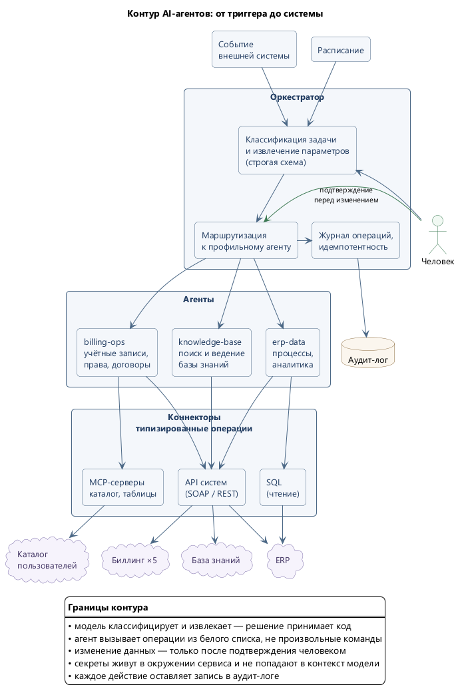

# AI Agent Registry — реестр связанных AI-агентов для бизнес-процессов

Публичная обезличенная версия рабочего контура AI-агентов, который я построил и эксплуатирую
в IT-подразделении телеком-оператора (5 биллинговых инстансов, ERP, корпоративная база знаний).

Внутренние адреса, доменные имена, названия систем и брендов, структура таблиц и любые креды
из этой версии убраны. Архитектура, роли агентов, границы полномочий и политики — те же, что в проде.

## Зачем это опубликовано

Показать не «промпты, которые я пишу», а **инженерный контур вокруг LLM**: кто из агентов
чем управляет, где проходят границы их полномочий, что происходит до изменения данных
в боевой системе и что остаётся в журнале после.

## Схема контура



Исходник диаграммы: [contour-overview.puml](docs/diagrams/contour-overview.puml)

## Флоу и их статус

| # | Бизнес-процесс | Что делает агент | Статус |
|---|---|---|---|
| 01 | [Управление учётными записями и правами](docs/flows/01-account-provisioning.md) | Заводит, блокирует, меняет пароли и роли сотрудников сразу в 5 системах по заявке на естественном языке | **в эксплуатации** |
| 02 | [Миграция учётных записей в каталог](docs/flows/02-directory-migration.md) | Перенёс сотни учёток в корпоративный каталог с маппингом ролей на группы | **выполнено разово** |
| 03 | [Ведение корпоративной базы знаний](docs/flows/03-knowledge-base.md) | Ищет по базе знаний, читает страницы, вносит согласованные правки | **в эксплуатации** |
| 04 | [Автопилот задач ERP](docs/flows/04-erp-task-autopilot.md) | Принимает назначенную на исполнителя задачу из ERP, выполняет её в биллинге (перенос средств, операции с учётными записями) и закрывает процесс с отчётом | **спроектирован, готов к реализации** |

Статусы в таблице отражают реальность, а не витрину. Флоу 04 — не набросок и не идея:
архитектура, контракты, каталог обрабатываемых операций, полный список предварительных проверок,
обработка частичных сбоев, идемпотентность и метрики проработаны до уровня, с которого пишется код.
Кода пока нет — операции из его каталога сегодня выполняются теми же агентами, но с человеком
в качестве триггера; флоу 04 убирает человека из роли передаточного звена, оставляя его на подтверждении.

## Автоматизации без AI

Не всякий бизнес-процесс требует языковой модели. В [docs/no-ai-automations/](docs/no-ai-automations/)
собраны две автоматизации, которые работают в эксплуатации и не обращаются к модели вовсе —
потому что вход у них структурирован, множество исходов конечно, а объём измеряется тысячами
операций в месяц.

| # | Автоматизация | Что делает | Статус |
|---|---|---|---|
| 01 | [Автообзвон: оценка качества выезда](docs/no-ai-automations/01-montage-survey-robocall.md) | Робот звонит абоненту после выезда монтажника, собирает оценку тональным набором и по результату подтверждает заявку либо возвращает её в работу | в эксплуатации, ~2 500 заявок в месяц |
| 02 | [СМС-информирование по заявкам на подключение](docs/no-ai-automations/02-sms-notification.md) | Сообщает клиенту принятое решение по заявке вместо ручного обзвона диспетчером | в эксплуатации |

Инженерная обвязка у них та же, что и в AI-флоу: идемпотентность, разделение «передано»
и «доставлено», изоляция отказов внешних сервисов, лимиты и окна, аудит в самом бизнес-процессе.
Отличается только то, кто принимает решение о содержании действия — конечный автомат или модель.

## Принципы, на которых собран контур

1. **Белый список инструментов вместо произвольного доступа.** Агент не получает shell к боевой
   системе. Он получает набор типизированных операций («найти сотрудника», «заблокировать»,
   «перенести средства»). Модель может ошибиться в намерении, но физически не может выполнить
   ничего за пределами набора.
2. **Решение принимает код, а не модель.** LLM классифицирует задачу и извлекает параметры
   в жёсткую схему. Проверяет допустимость операции и исполняет её детерминированный код.
3. **Подтверждение человеком перед изменением.** Схема любой мутирующей операции:
   `план → предпросмотр затрагиваемых объектов → подтверждение → исполнение → верификация → аудит-лог`.
   Чтение — без подтверждения, изменение — никогда.
4. **Секреты не попадают в контекст модели.** Пароли и токены живут в файлах кредов и переменных
   окружения, подставляются на исполнении. См. [policies/secrets.md](policies/secrets.md).
5. **Массовые операции — по ритуалу.** Письменный фильтр, границы скоупа, dry-run со счётчиком,
   10 примеров, план отката. См. [policies/bulk-operations.md](policies/bulk-operations.md).
6. **Идемпотентность и журнал.** Повторный триггер не выполняет операцию дважды; каждое действие
   остаётся в аудит-логе с исходным запросом, планом и результатом.

## Структура репозитория

```
agents/     — обезличенные конфигурации трёх агентов: роль, зона ответственности, запреты
mcp/        — MCP-коннектор к каталогу пользователей (обезличенный) и описание Excel-коннектора
policies/   — сквозные политики: human-in-the-loop, массовые операции, гигиена секретов
docs/       — архитектура, модель безопасности, описания флоу
```

## Оговорка

Репозиторий описывает подход и архитектуру. Рабочие конфигурации содержат внутренние адреса,
доменные имена и специфику вендорских систем — они под NDA и здесь отсутствуют.
