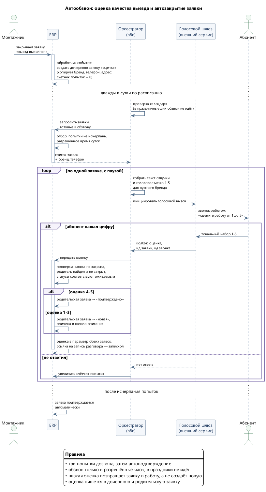

# 01. Автообзвон: оценка качества выезда и автозакрытие заявок

**Статус: в эксплуатации с сентября 2025. Около 2 500 обработанных заявок в месяц.**

## Задача

После выезда монтажника к абоненту нужно две вещи: убедиться, что проблема действительно решена,
и закрыть заявку. Раньше и то, и другое делал диспетчер — обзванивал абонентов вручную
и вручную же подтверждал выполнение. При потоке в тысячи выездов это либо не делалось вовсе,
либо съедало рабочее время целиком.

Автоматизация закрывает обе задачи: робот звонит абоненту, собирает оценку тональным набором
и по её значению либо подтверждает заявку, либо возвращает её в работу. Ручного труда
в цепочке не осталось.

## Схема

Исходник диаграммы: [01-robocall-survey.puml](diagrams/01-robocall-survey.puml)

## Как устроено

**Триггер — двухступенчатый.** Монтажник закрывает заявку о выезде; штатный обработчик события
ERP создаёт связанную дочернюю заявку «оценка качества», копируя в неё бренд, телефон, адрес
и обнуляя счётчик попыток дозвона. Отдельно, дважды в сутки, планировщик оркестратора забирает
из ERP все заявки, готовые к обзвону.

Разделение сделано намеренно: создание заявки должно происходить мгновенно и в той же
транзакции, что и закрытие выезда, а обзвон — по расписанию, порциями и в разрешённые часы.

**Обзвон.** Оркестратор запрашивает у ERP список заявок, собирает для каждой текст озвучки
с голосовым меню и инициирует вызов через внешний шлюз. Заявки обрабатываются по одной,
с паузой между вызовами. Компания работает под пятью брендами — маршрутизация выбирает нужный
аккаунт шлюза, чтобы абонент услышал название своего оператора и увидел его номер.

**Сбор ответа.** Абонент нажимает цифру от одного до пяти; шлюз вызывает вебхук оркестратора
с номером нажатой клавиши, идентификатором заявки и идентификатором звонка. Последнее важно
практически: по нему в кабинете шлюза находится запись разговора, и она прикладывается
к заявке запиской — при спорной низкой оценке есть что послушать.

**Решение.** Оценка проверяется и применяется в ERP:

| Оценка | Заявка «оценка качества» | Родительская заявка о выезде |
|---|---|---|
| 4–5 | закрывается | **подтверждена** |
| 1–3 | закрывается | **возвращается в работу**, причина дописывается в начало описания заглавными буквами |

Перед применением выполняются проверки: заявка оценки существует и не закрыта, родительская
найдена и не закрыта, обе в ожидаемых статусах. Если хоть одна не прошла — не меняется ничего,
возвращается ошибка с причиной.

Оценка записывается в параметр **обеих** заявок — дочерней и родительской. Это сделано ради
отчётности: искать качество работ по дочерним заявкам неудобно, оно должно быть видно прямо
на выезде.

**Если не дозвонились.** Счётчик попыток растёт, заявка попадает в следующую рассылку.
После трёх неудачных попыток заявка **подтверждается автоматически**. Это осознанное решение,
а не упрощение: молчание абонента не может блокировать закрытие заявки навсегда, иначе система
превратится в свалку незакрытых выездов.

## Предохранители

- **Ночной запрет.** Обзвон не работает с позднего вечера до утра — проверка стоит в коде,
  а не только в расписании: ручной запуск в неурочное время вернёт пустой список.
- **Праздничные дни.** В новогодние каникулы обзвон не запускается; вместо него уходит
  уведомление ответственному.
- **Пауза между вызовами** — чтобы не создавать всплеск нагрузки на шлюз и не выглядеть
  спам-рассылкой.
- **Ограничение попыток** — три звонка на заявку, дальше автоподтверждение.

## Результаты

Данные с момента запуска (сентябрь 2025) по август 2026:

| Показатель | Значение |
|---|---|
| Создано заявок на оценку | ~25 500 |
| Из них с полученной оценкой | ~4 000 (16%) |
| Закрыто автоподтверждением без ответа | ~21 200 (81%) |
| Прирост | ~2 500 заявок в месяц |

Распределение оценок: «отлично» — 3 471, «четыре» — 144, «три» — 61, «два» — 53,
«проблема не решена» — 316.

Читать эти цифры стоит так: **16% дозвона — это не провал, а нормальная конверсия
холодного автообзвона**, и она даёт около 4 000 честных оценок в год, которых раньше
не было вовсе. Ещё важнее второе: 21 200 заявок закрылись без участия диспетчера.
Отвечают в основном с первой-второй попытки — если абонент не взял трубку дважды,
третий звонок почти ничего не добавляет.

Отдельный результат — **316 сигналов «проблема не решена»**, каждый из которых вернул заявку
в работу автоматически, в день выезда, а не когда абонент дозвонится до поддержки сам.

