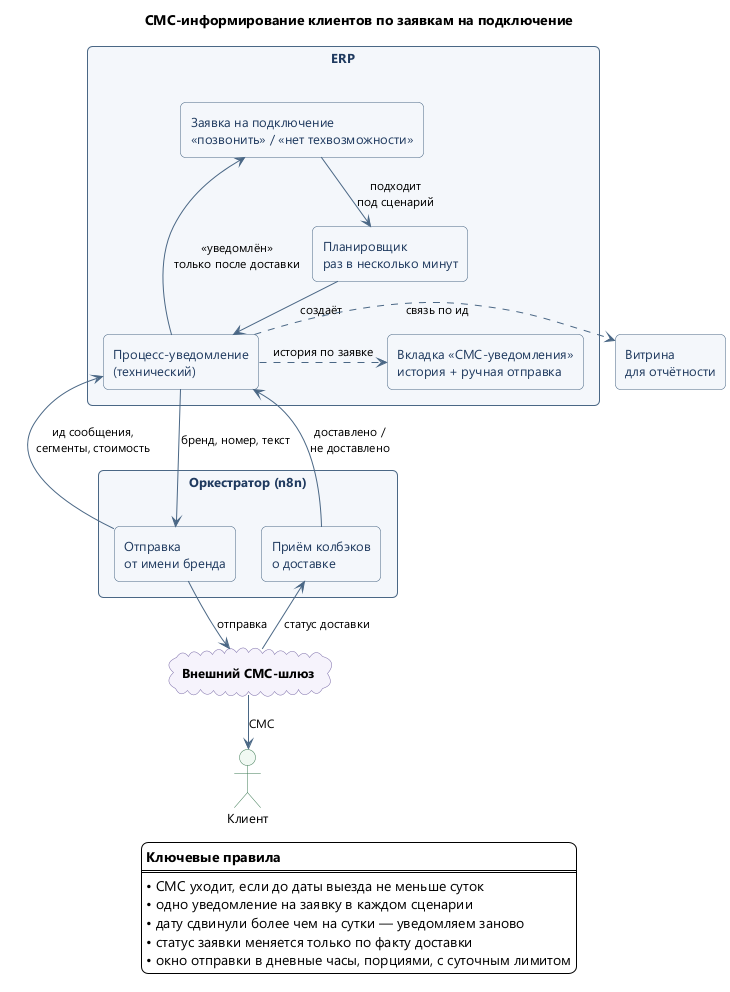
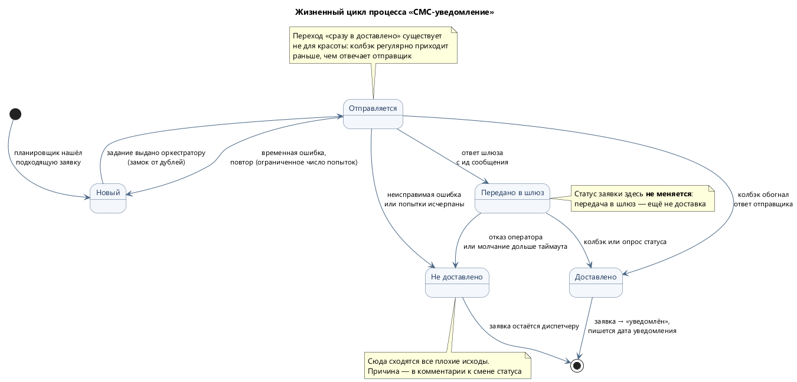

# 02. СМС-информирование по заявкам на подключение

**Статус: в эксплуатации с сентября 2026.**

## Задача

Клиент оставляет заявку на подключение. Внутри компании по ней принимается решение — назначается
возможная дата выезда либо фиксируется отсутствие технической возможности. Проблема была
в последнем шаге: **решение принято, но клиент о нём не знает, пока до него не дозвонится
диспетчер**. Заявки копились в статусе «позвонить», клиент ждал.

Автоматизация закрывает разрыв: как только решение принято, клиенту уходит СМС, а заявка сама
переходит в статус «уведомлён». Диспетчеру остаются только недоставленные и нестандартные случаи.

## Схема

Исходник: [02-sms-overview.puml](diagrams/02-sms-overview.puml)

## Жизненный цикл уведомления

Каждое уведомление — отдельный технический процесс в ERP со своим жизненным циклом.
Так история переписки с клиентом хранится в той же модели данных, что и всё остальное,
и видна прямо в карточке заявки.

Исходник: [03-sms-lifecycle.puml](diagrams/03-sms-lifecycle.puml)

Ключевое различие в этом цикле — между **«передано в шлюз»** и **«доставлено»**. Статус
клиентской заявки меняется только по второму: отправленное, но не дошедшее сообщение не должно
выглядеть как выполненная работа.

## Инженерные решения

**Замок от дублей.** Задание выдаётся оркестратору условной сменой статуса: перевести процесс
в «отправляется» может только тот, кто застал его в «новом». Параллельный запуск планировщика
не выдаст одно задание дважды. Поверх этого — барьер по содержимому (одно и то же сообщение
по заявке дважды не уходит) и блокировка на время ручной отправки.

**Идемпотентность обработки статуса.** Колбэк о доставке регулярно приходит **раньше**, чем
отвечает отправщик. Это не аномалия, а нормальный режим, поэтому обработка результата написана
идемпотентно, а в жизненный цикл добавлен переход «сразу в доставлено».

**Изоляция отказов.** Обработчик события в ERP не должен падать, если оркестратор недоступен:
иначе диспетчер не сможет двигать заявку по статусам из-за постороннего сервиса. Внешняя
интеграция обязана деградировать в «уведомление не ушло», а не в «система встала».

**Нельзя откатывать заявку назад.** Если диспетчер уже увёл заявку дальше по процессу,
результат доставки сохраняется, но статус не трогается. Автоматика не спорит с человеком.

**Лимиты и окна.** Жёсткий суточный потолок с оповещением на подходе к нему, окно отправки
в дневные часы, ограниченное число попыток, таймаут ожидания статуса доставки. На пилоте —
белый список номеров: сообщения уходили только на согласованные телефоны, всё остальное
отбрасывалось.

**Порог по дате.** Уведомление уходит, только если до предполагаемой даты выезда остаётся
не меньше суток — сообщение «завтра приедем» за час до приезда бесполезно. Если дату сдвинули
больше чем на сутки, клиент уведомляется заново.

## Экономика

Считалась до запуска, и здесь был поучительный момент: **фактическая цена сегмента оказалась
почти втрое выше той, что закладывали изначально**. Выяснилось это не из прайса, а тестовой
отправкой с проверкой списания — прайс и реальный тариф разошлись.

| Показатель | Значение |
|---|---|
| Ожидаемый объём | ~3 100 сообщений в месяц |
| Стоимость сегмента | 5,85 ₽ (проверено фактической отправкой) |
| Расход | ~18 100 ₽ в месяц |
| Длина шаблона | 62 символа — укладывается в один сегмент |

Порог «не меньше суток до выезда» — тоже результат расчёта: при пороге в трое суток объём падал
до ~2 000 сообщений, но часть клиентов оставалась неинформированной. Выбор порога — это выбор
между охватом и расходом, и он был сделан с цифрами на руках, а не на глаз.

Длина шаблона в 62 символа — не случайность: превышение границы сегмента удваивает стоимость
всей рассылки.

## Тестирование и вывод в прод

- **Нагрузочный расчёт до разработки**: по истории заявок за два месяца проверено, что суточный
  лимит не будет упираться в потолок — дней с превышением не нашлось, пиковые сутки дали
  около 60% лимита.
- **Ручные тест-кейсы** отдельным документом, прогон перед выкатом.
- **Пилот с белым списком**: в первом прогоне из полусотни готовых уведомлений наружу ушло
  ровно одно — на согласованный номер, остальные отброшены фильтром. Это проверялось до
  снятия ограничения.
- **Сквозной тест**: от появления задания до подтверждённой доставки — две секунды.
- **Граница по дате**: заявки, вошедшие в целевые статусы до даты запуска, автоматика не трогает —
  по ним работают как раньше, без задним числом рассылаемых уведомлений.

## Проектные артефакты

Разработка велась с полным проектным следом: требования и договорённости с постановщиком,
архитектура, факты из БД с проверенными цифрами, план работ с оценкой, открытые вопросы,
чек-лист настройки, ТЗ для оркестратора, тест-кейсы, статья в корпоративную вики.
Диаграммы в этом разделе — из проектной документации, обезличенные для публикации.
